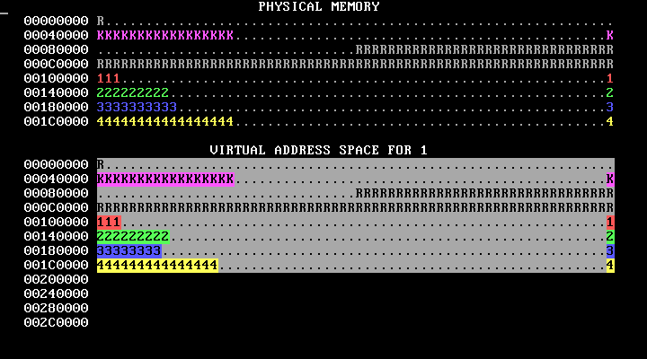
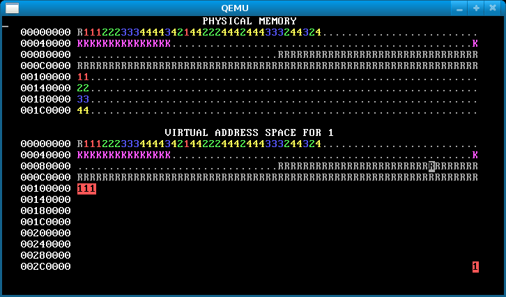
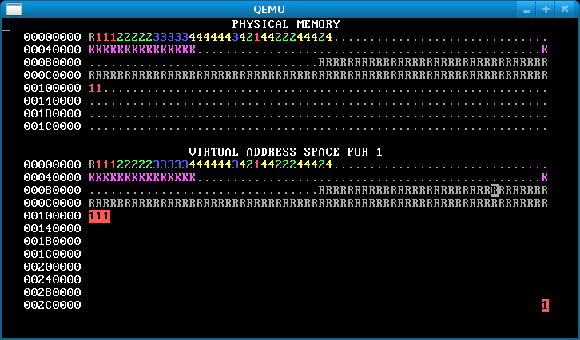

# virtual_memory
The following project makes use of two pieces of software, namely Weensy OS and hardware emulator QEMU. 

When you run Weensy OS, it displays a visual representation of both physical and virtual memory. Highlighted memory addresses indicate the pages accessible by each process upon execution. Below are two labeled memory diagrams, showing what the characters mean and how memory is arranged:

Initial state of memory shows no isolation, address space abstraction and processes cannot implement fork nor exit.

Implemented isolation using virtual memory, so that a process cannot modify kernel or other processes’ code/data + abstract address space for each process + fork and exit system calls on Weensy OS such that upon calling specific allocator programs on the machine, we can get desired behavior of memory usage and allocation.

Normal allocator:

Write protected kernel address space (as shown by the K-pages not being highlighted when processes run), isolated address spaces by allocating a page table for each process, changed algorithm to allocate physical pages and sharing stack.

Forking allocator:

Implemented forking of processes, with adequate copying of data and mappings

Fork-exit allocator (runs indefinitely):

Implemented exit and clean-up whenever physical pages are used up.
